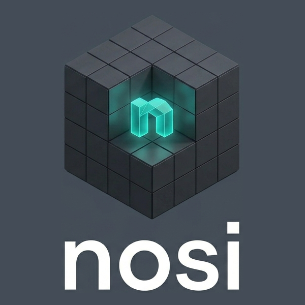

  

# **N**ic(h)e **O**perating **S**ystem **I**mages

*(Pronounced "nosy", because I can't help putting these images on every machine I touch.)*

Automated, rolling builds of headless and desktop system images for bare metal
(x86_64, Raspberry Pi 4/5) and virtual machines (QEMU, WSL2, Proxmox), plus
container images (OCI, LXC),
pre-loaded with an opinionated toolset for systems-development work in C, C++,
Python, Rust, and Zig. Flash the `.img.gz` with `dd` (or any tool that handles
gzip-compressed disk images) and you have a ready-to-SSH dev box. The companion
project [bty](https://github.com/safl/bty) is one convenient flasher; it is not
required.

## Documentation

The variant catalog, quick start, pull/flash recipes, default credentials, the
desktop shape, and the rolling-release model all live at:

### → <https://safl.dk/nosi>
